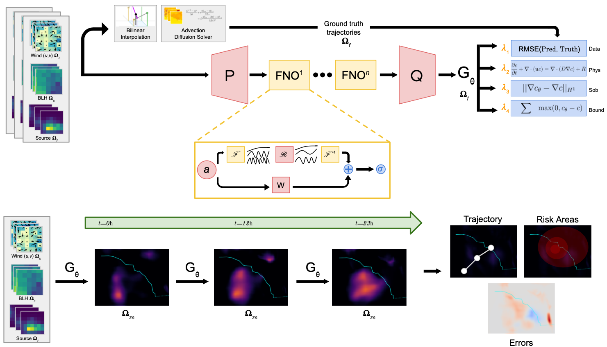

# SmokeCastFNO

 

 

**SmokeCastFNO** is a physics-informed predictive engine designed to provide fast, computationally inexpensive, and accurate projections of smoke plume dynamics to local agencies. SCFNO uses a [Fourier Neural Operator]([url](https://github.com/neuraloperator/neuraloperator)) (Li et al, 2020) backbone to provide predictions. The model is trained on sparse 25km-resolution ERA5 data on a 13x21 grid spanning Southern California. The user specifies a source on a finer 52x84 grid. The sparse ERA5 data is then bilinearly interpolated to the 52x84 grid to match the plume source reading. This process does not add any spectral energy to the data. The two are then projected into the frequency domain using then passed into the FFT-SpecConv2D-IFFT (FNO) block. The resulting operator learns the mapping between temporal states of the smoke plume, which we then apply autoregressively at inference time to yield 24 hour forecasts.

# Using SmokeCastFNO

To use SmokeCastFNO, download both the solver file (link coming soon) and the training and evaluation file (link coming soon). The solver generates data using a CFL-stable finite difference scheme, which is cheap and can be run on your own device. The training can be done either on your device (which will take longer) or on Kaggle. If you are using Kaggle, we recommend using the GPU T4 x2 accelerator. The data is imported from the [Copernicus Data Store]([url](https://cds.climate.copernicus.eu/datasets/reanalysis-era5-single-levels?tab=overview)), so please register for free there to receive their API keys.

# Requisite Libraries and Software
Coming soon.
